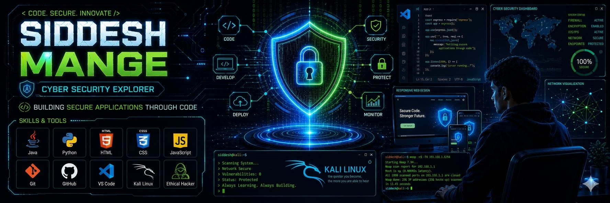

<p align="center">
  
</p>

<h1 align="center">Hi 👋, I'm Siddesh Mange</h1>

<h3 align="center">
🔐 Cyber Security Explorer | ☕ Java Developer | 🌐 Web Developer
</h3>

<p align="center">

</p>

<p align="center">

</p>


---

# 👨‍💻 About Me

```yaml
Name: Siddesh Mange
Education: B.Tech CSE
University: Parul University
Country: India

Domains:
  - Cyber Security
  - Networking
  - Cryptography
  - Java Development
  - Python Programming
  - Web Development

Goal:
  Become a skilled Cyber Security Professional
```

---

# ⚡ Tech Stack

<p align="center">


</p>

---

# 🔐 Cyber Security Domains

<p align="center">


</p>

---

# 🌐 Contribution Graph

<p align="center">

</p>

---


## 🔥 GitHub Streak

<p align="center">
  
</p>
---

# 🏅 GitHub Achievements

<p align="center">


</p>


---

# 🧠 Random Developer Quote

<p align="center">

</p>

---


<p align="center">

</p>

---

# 📫 Connect With Me

<p align="center">

<a href="mailto:siddeshmange258@gmail.com">

</a>

<a href="https://github.com/siddesh3448">

</a>

<a href="https://linkedin.com">

</a>

</p>

---

<p align="center">

⭐ Always Learning • Always Building • Always Securing ⭐

</p>


